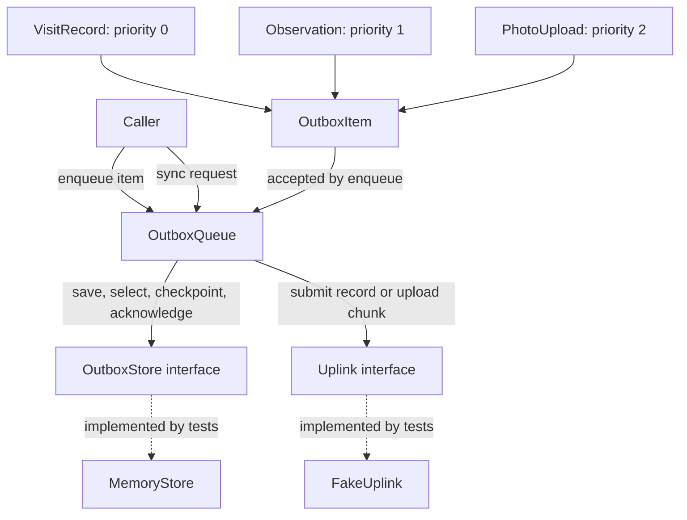
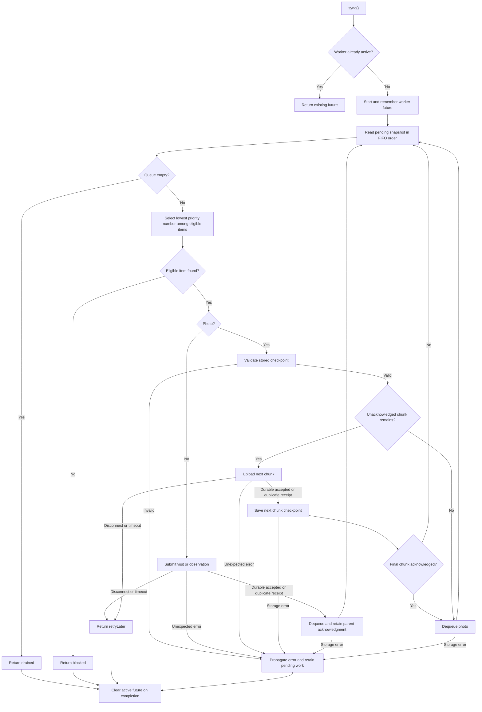

# Outbox sync flow

These diagrams describe the implemented pure-Dart queue. Storage and uplink are
interfaces, exercised by in-memory fakes in tests; production adapters are outside
this implementation.

## Components



IDs are supplied by the caller. PendingItem stores the item and the next
unacknowledged photo chunk. Parent visit acknowledgments remain available after
visit records leave the queue.

## Worker and priority selection



Eligibility requires an acknowledged parent for observations and photos. Equal
priorities preserve FIFO. Selection is repeated after each photo chunk, allowing
new structured data to preempt photos. Errors from storage reads also propagate;
all worker completion paths clear the active future. A scheduler, not this queue,
chooses when to retry. Coalescing applies to one queue instance.

## Lost visit confirmation

```mermaid
sequenceDiagram
    participant Caller
    participant Queue as OutboxQueue
    participant Store as OutboxStore
    participant Server as Uplink / fake server
    Caller->>Queue: sync()
    Queue->>Store: pending()
    Store-->>Queue: Visit with stable operation ID
    Queue->>Server: submit same operation ID and content
    Server->>Server: Commit operation once
    Server--xQueue: Confirmation lost; TimeoutException
    Queue-->>Caller: retryLater
    Note over Store: Visit remains pending
    Caller->>Queue: sync() later
    Queue->>Store: pending()
    Store-->>Queue: Same visit and operation ID
    Queue->>Server: Retry same operation
    Server-->>Queue: duplicate receipt
    Queue->>Store: acknowledge visit
    Store->>Store: Dequeue; retain visit acknowledgment
    Queue-->>Caller: drained if no other work remains
```

Duplicate means identical content was already durably committed. Server-side
idempotency is a required uplink contract; the test fake models it.

## Interrupted photo and priority between chunks

```mermaid
sequenceDiagram
    participant Caller
    participant Queue as OutboxQueue
    participant Store as OutboxStore
    participant Server as Uplink / fake server
    Note over Queue,Store: Parent visit already acknowledged; nextChunk = 0
    Caller->>Queue: sync()
    Queue->>Server: uploadChunk(photo, 0)
    Server-->>Queue: accepted
    Queue->>Store: checkpoint(photo, 1)
    Queue->>Store: Re-read pending and select eligible work
    Queue->>Server: uploadChunk(photo, 1)
    Server--xQueue: Mid-transfer disconnect
    Queue-->>Caller: retryLater
    Note over Store: nextChunk stays 1
    Caller->>Queue: sync() later
    Queue->>Store: Read checkpoint and select work
    Queue->>Server: uploadChunk(photo, 1)
    Server-->>Queue: accepted or matching duplicate
    Queue->>Store: checkpoint(photo, 2)
    Queue->>Store: Re-read pending; new structured data goes first
    Note over Queue,Server: Deliver eligible visits/observations before continuing photo
    Queue->>Server: uploadChunk(photo, 2)
    Server-->>Queue: accepted
    Queue->>Store: checkpoint(photo, 3)
    Queue->>Store: acknowledge photo
    Queue-->>Caller: drained if no other work remains
```

This example has three chunks. If a receipt is lost after server commitment,
replaying that chunk is safe under the uplink contract. If saving a checkpoint
fails, progress stays behind and the next attempt safely replays the chunk.
Actual byte transfers, durable disk recovery, and server photo assembly are not
implemented by the exercise's fakes.
